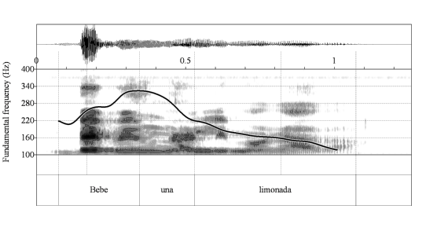
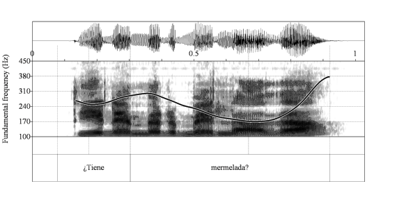
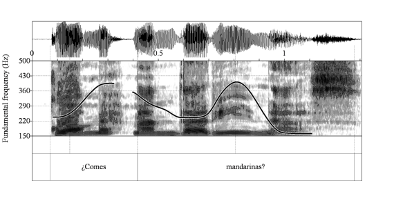

```{r}
#| label: setup
#| include: false
options(htmltools.dir.version = FALSE)
knitr::opts_chunk$set(
  echo = TRUE, 
  fig.asp = 0.5625,
  out.width = "100%", 
  fig.retina = 2, 
  dpi = 300
  )

set.seed(20260402)

source(here::here("scripts","r","00_libs.R"))
source(here::here("scripts","r","01_helpers.R"))
source(here::here("scripts","r","02_load_data.R"))
source(here("scripts","r","10_manuscript_stats.R"))

theme_psllt <- function(...) {
  list(
    theme_bw(base_family = "Palatino", ...), 
    theme(
      plot.subtitle = element_text(color = "grey40"), 
      panel.grid.major = element_line(color = 'grey90', linewidth = 0.15),
      panel.grid.minor = element_line(color = 'grey90', linewidth = 0.15)
    )
  )
}

theme_set(theme_grey(base_size = 30))

```

## Open Sciences

<br><br>

<center>
[Pre-registered on OSF]{.p-font style="font-size: 1.75em; color: grey"}


### <https://osf.io/vpseq/>

<div>


</div>

</center>

# Roadmap {.transition}

::: {.fragment .fade-up}
::: {.fragment .semi-fade-out}
intonation
:::
:::

::: {.fragment .fade-up}
::: {.fragment .semi-fade-out}
empathy
:::
:::

::: {.fragment .fade-up}
::: {.fragment .semi-fade-out}
L2 intonation & incidental learning
:::
:::

::: {.fragment .fade-up}
::: {.fragment .semi-fade-out}
modeling of L2 intonation
:::
:::

::: {.fragment .fade-up}
::: {.fragment .semi-fade-out}
present study
:::
:::

## Intonation

- Modulation of [fundamental frequency]{.emph} (F0) across an utterance
- F0 generated by vibrating vocal folds
- We interpret the frequency as [pitch]{.emph}

:::: {.fragment}
::: {.absolute top="375" left="350"}
<div style="text-align:center; width:100%;">
  
</div>

:::

::::

## Intonation

Intonation [@pierrehumbert1980phonology; @ladd2008intonational] has a many-to-many mapping that variably signals...

::: incremental

- syntactic structure [@rao2006intonation]
- constituent focusing [@buring2016intonation]
- affective meaning [@rodero2011intonation]
- politeness [@herrero2020perception]
- ...
- [sentence modality]{.emph} [@navarro1974manual]

:::

## Individual Differences in Empathy

In [L1 speakers]{.emph}, empathy predicts...

::: incremental
- [greater sensitivity]{.emph} to intonation cues when disambiguating ambiguous referent [@esteve2020empathy]
- [more nuanced]{.emph} mapping of pitch span to epistemic bias [@orrico2020individual]
- [greater accuracy]{.emph} of content-based questions regarding brief videos [@melchers2017oxtr]

:::

## Individual Differences in Empathy

In [L1 EN L2 ES learners]{.emph}, empathy predicts [more accurate]{.emph} perception of sentence modality in low-proficiency learners [@casillas2023using]

## Sentence Modality

::: {.absolute top="70" left="-25%"}
<div style="text-align:center; width:100%;">
  <audio controls style="width: 100%;">
    <source src="figs/slides_only/spain_statement.mp3" type="audio/mpeg">
  </audio>

  <br>

  
</div>

:::

::: {.absolute top="70" right="-25%"}
<div style="text-align:center; width:100%;">
  <audio controls style="width: 100%;">
    <source src="figs/slides_only/spain_yn_question.mp3" type="audio/mpeg">
  </audio>

  <br>

  
</div>
:::

::: footer
@aguilar2024sptobi

@face2007role

:::

::: notes
First pitch peak, presence of medial pitch accent, nuclear pitch accent, and boundary tone.

:::

## Statement or Question?

<audio controls style="width: 80%;">
  <source src="figs/slides_only/venezuela_yn_question.mp3" type="audio/mpeg">
</audio>

::: footer
@aguilar2024sptobi

:::

## Statement or Question?

::: {.absolute top="70" left="-25%"}
<div style="text-align:center; width:100%;">
  <audio controls style="width: 100%;">
    <source src="figs/slides_only/venezuela_yn_question.mp3" type="audio/mpeg">
  </audio>

  <br>

  
</div>
:::

::: footer
@aguilar2024sptobi

:::

## ¿Es una pregunta? {.smaller}

- neutral yes-no questions with low boundary tones documented in...
  - Puerto Rican [@armstrong2010puerto]
  - Dominican [@willis2010dominican]
  - Venezuelan [@astruc2010venezuelan]
  - Argentinian [@gabriel2010argentinian]
  - Galician [@perez2024basic]

## L2 Intonation {.smaller}

::: fragment

- L1 Mandarin L2 Spanish requests are judged as [impolite]{.emph}, even with lexical-grammatical aggression mitigators, due to non-target-like intonation [@herrero2020unintentional]

:::

::: fragment

- "Polite" responses to wh- questions differ in English & Spanish [@estebas2014evaluation]
  - L1 EN L2 ES perceived as [over-excited]{.emph}
  - L1 ES L2 EN perceived as [rude]{.emph}

:::

::: fragment

- Accurate production/perception of [sentence modality]{.emph} in Spanish almost entirely depends on intonation [@brandl2020development]

:::

## Intonation in the L2 Classroom

Intonation remains [sidelined]{.emph} in the L2 classroom [@rao2019key; @jenkins20045; @lord2013teaching]

::: fragment
Explicit instruction leads to meaningful improvements [@olea2019effectiveness; @sonsaat2025intonation]...

:::

::: fragment
but most learners seem to be acquiring intonation via incidental learning [@hulstijn2003incidental], so we should learn more about that process

:::

## Development of L2 Intonation

- L1 EN L2 ES [perception]{.emph} of intonation becomes more accurate with increasing [proficiency]{.emph} as measured by...
  - course level in university [@nibert2006acquisition; @brandl2020development]
  - Elicited Imitation Task test [@zarate2015perception]
  - LexTALE [@casillas2023using]

::: fragment

- L1 EN L2 ES [perception and production]{.emph} becomes more accurate with [study abroad experience]{.emph} [@henriksen2010development; @trimble2023acquiring; @craft2015acquisition]

:::

## Development of L2 Intonation {.smaller}

- Most L2 models [omit]{.emphasis} suprasegmental features [@flege2021revised; @van2015learning; @best2007nonnative]

- L2 Intonation Learning theory [LILt; @mennen2015beyond] predicts L2 difficulty based on...
  1. the inventory and distribution of categorical phonological elements
  2. the phonetic implementation of those elements
  3. the functionality of the elements
  4. the frequency of use of each element

But so far, ignores proficiency, experience, and individual differences

## LILt Predictions {.smaller}

1. **Inventory & distribution**
   - (Caribbean) Spanish & American English both have L%

2. **Phonetic implementation**
   - Phonetically similar across languages

3. **Function**
   - Spanish: L% → neutral yes-no questions  
   - American English: H% → neutral yes-no questions
   - American English: L% used, but associated with disingenuous question [@hedberg2017meaning]

4. **Frequency**
   - How often are these forms encountered... and by who?
   
## LILt Predictions & Beyond

::: fragment

L1 EN–L2 ES learners struggle to perceive yes-no questions with [L%]{.emph}
[@george2024l2; @brandl2020development; @trimble2013perceiving]
:::

::: fragment

Proficiency, experience (e.g., study abroad), L1-L2 transfer seem strong predictors...

:::

::: fragment

but no evidence that [empathy]{.emph} helps...

:::

# Present Study 

## {.smaller}

- L1 EN L2 ES learners struggle with accurate identification of sentence type for Spanish yes-no questions with low boundary tones
  - Understanding dialectal variation is part of communicative competence [@canale1987measurement]

::: fragment
- The majority of research on intentional and incidental learning has focused primarily on vocabulary, spelling, morphology, and syntax
  - [phonetics and phonology]{.emph} have received little attention [@hulstijn2003incidental]
  - What internal/external factors contribute to the efficacy of incidental learning?

:::

::: fragment
- Empathy impacts L1 and L2 processing of intonation
  - What does early exposure to a new form look like for high-empathy individuals?
  
:::

## Research Questions {.smaller}

1. Do higher-empathy, compared to lower-empathy, L1 English L2 Spanish learners display higher accuracy when identifying a Spanish utterance as a declarative versus interrogative?
  - Partial replication of @casillas2023using
  - Predicting similar results:
    - Higher accuracy with increasing proficiency
    - Low-proficiency high-empathy learners more accurate than proficiency-matched peers
    
## Research Questions {.smaller}

2. Do higher-empathy, compared to lower-empathy, L1 English L2 Spanish learners display higher accuracy when identifying a Spanish utterance, from a variety to which they have little or no previous exposure, as an interrogative if they are briefly exposed to conversations from that variety?
  - Higher-empathy individuals more accurate than proficiency-matched peers after brief incidental-learning training session at all proficiency levels

# Methodology {.transition}

## Participants

- Two experiments launched on Prolific.ac to collect data
- Differed only in exposure task
- All participants asked, "Are you familiar with Caribbean (e.g., Puerto Rican) or Galician Spanish?"
  - Served as proxy for familiarity with yes-no questions with final fall
  - Participants recruited until 100 responded "no" for each experiment
  
## Participants

- L1 English born, raised, and currently living in Northeastern US
- Grew up monolingual English
- No hearing difficulties
- Required to use headphones on personal computer

## RQ1 Participants

```{r}
#| label: tbl-participants-rq1
#| echo: false

ft_rq1 <- flextable(demo_rq1 %>%
  summarize(
    age_mean = round(mean(age), 1),
    age_sd = round(sd(age), 1),
    female = sum(sex == "Female"),
    male = sum(sex == "Male"),
    two = sum(two_langs == "no, only English or Spanish"),
    more_two = sum(two_langs == "yes, I am fluent in another language"),
    unknown = sum(two_langs == "click here to respond")
  ) 
)

ft_rq1 <- set_header_labels(
  ft_rq1,
  age_mean = "Mean",
  age_sd = "SD",
  female = "Female",
  male = "Male",
  two = "2",
  more_two = ">2",
  unknown = "Not reported"
)

ft_rq1 <- add_header_row(
  ft_rq1,
  values = c("Age (years)", "Reported gender", "# of languages reported"),
  colwidths = c(2, 2, 3)
) %>%
  align(align = "center", part = "all") %>%
  bold(part = "header") %>%
  autofit()

ft_rq1
```

## RQ2 Participants

```{r}
#| label: tbl-participants-rq2
#| echo: false

ft_rq2 <- flextable(demo_rq2 %>%
                      mutate(group = if_else(
                        group == 0, "control", "exposure"
                      )) %>%
                      group_by(group) %>%
  summarize(
    age_mean = round(mean(age), 1),
    age_sd = round(sd(age), 1),
    female = sum(sex == "Female"),
    male = sum(sex == "Male"),
    other = sum(sex == "Prefer not to say"),
    two = sum(two_langs == "no, only English or Spanish"),
    more_two = sum(two_langs == "yes, I am fluent in another language"),
    unknown = sum(two_langs == "click here to respond")
  )
)

ft_rq2 <- set_header_labels(
  ft_rq2,
  group = "",
  age_mean = "Mean",
  age_sd = "SD",
  female = "Female",
  male = "Male",
  other = "Not reported",
  two = "2",
  more_two = ">2",
  unknown = "Not reported"
)

ft_rq2 <- add_header_row(
  ft_rq2,
  values = c("", "Age (years)", "Reported gender", "Number of languages reported"),
  colwidths = c(1, 2, 3, 3)
) %>%
  align(align = "center", part = "all") %>%
  bold(part = "header") %>%
  autofit()

ft_rq2
```

## Exposure Sesssions

- Exposed to three naturalistic phone conversations between two speakers
  - Dominican
  - Puerto Rican
  - Galician 
  
```{r}
#| label: tbl-stimuli
#| echo: false

stim_table <- data.frame(
  dialect = c("Dominican", "Galician", "Puerto Rican", "TOTAL"),
  "time (seconds)" = c(60, 47, 36, 143),
  "# of absolute interrogatives" = c(10, 5, 6, 21),
  "# of final fall absolute interrogatives" = c(7, 3, 6, 16),
  check.names = FALSE
)

stim_ft <- flextable(stim_table) %>%
  align(align = "center", part = "all") %>%
  bold(part = "header") %>%
  autofit()

stim_ft
```

## Two-Alternative Forced Choice Task

- 88 items
  - Cuban (falling yes-no)
  - Puerto Rican (falling yes-no)
  - Mexican (rising yes-no)
  - Castillian (rising yes-no)
- Evenly split between broad focus declaratives and yes-no questions
- Three function words in subject-verb-object word order
- Object was always a noun with penultimate stress

## LexTALE

```{r}
#| label: tbl-lextale
#| echo: false

lextale_ft <- flextable(lextale_table) %>%
  colformat_double(digits = 2) %>%
  align(align = "center", part = "all") %>%
  bold(part = "header") %>%
  autofit()

lextale_ft
```

## LexTALE

```{r}
#| label: fig-lextale_distributions
#| echo: false

knitr::include_graphics(
  here("figs", "lextale_distributions.jpeg")
  )
```

## Empathy Quotient {.smaller}

- 60 items: 40 critical items and 20 distractors
- four-point Likert scale ranging from "strongly agree" to "strongly disagree"
- half of the target items are coded to elicit "agree" and the other half "disagree"
- target items are scored with 2 or 1 points based on if the participant responds "strongly" or "slightly" to the "empathic" response, and 0 otherwise
- summed to a single-point value
- Scores range from 0 (low empathy) to 80 (high empathy)

```{r}
#| label: tbl-eq
#| echo: false

eq_table_ft <- flextable(eq_table) %>%
  colformat_double(digits = 2) %>%
  align(align = "center", part = "all") %>%
  bold(part = "header") %>%
  autofit()

eq_table_ft
```

## Procedure

::: {.absolute top="70"}
<div style="text-align:center; width:100%;">
  <audio controls style="width: 100%;">
    <source src="stimuli/wavs_all/puertorican_match_interrogative-total-yn_Daniel-iba-a-Bolivia.wav" type="audio/mpeg">
  </audio>

  <br>

  Is this a question?
</div>
:::

## Statistical Analysis {.smaller}

- Bayesian multilevel logistic regression

- Accuracy as a function of...
  - RQ1
    - variety (rising Q or falling Q)
    - utterance type (broad focus declarative or yes-no question)
    - LexTALE score
    - EQ
    
  - RQ2
    - Group (exposure or control)
    - LexTALE score
    - EQ

# Results {.transition}

## RQ1

```{r}
#| label: fig-m-rq1-eq-lextale
#| echo: false

knitr::include_graphics(here("figs", "rq1_eq_lextale_patchwork.png"))
```

::: notes
LexTALE has no effect.

Empathy has an effect for Falling-Q declarative AND both Rising-Q sentence types.
:::

## RQ1

```{r}
#| label: fig-m-rq1-3way-interaction
#| echo: false

knitr::include_graphics(
  here("figs", "rq1_3way.png")
  )
```

::: notes
Rising-Q yn: as proficiency increases, empathy effect is stronger (weak effect).
Caribbean yn & declarative: as proficiency increases, empathy effect is stronger (but the effect is even weaker).

:::

## RQ2

```{r}
#| label: fig-m-rq2-lextale-eq
#| echo: false

knitr::include_graphics(
  here("figs", "rq2_eq_lextale_patchwork.png")
  )
```

::: notes
Equal positive effects for lextale.
No effect of empathy.

:::

## RQ2

```{r}
#| label: fig-m-rq2-3way-interaction
#| echo: false

knitr::include_graphics(
  here("figs", "rq2_3way.png")
  )
```

::: notes
For control group, there's no interaction between lextale & empathy.
For experimental group, there seems to be evidence for a very, very weak, unstable interaction, such that as proficiency increases, the empathy effect gets stronger.
:::

## Interaction: Proficiency × Empathy

- Proficiency held high: +4 SD (`r specify_decimal((4 * sd(rq2$lextale_tra) + mean(rq2$lextale_tra)),2)`; intermediate to advanced learners) 
- Empathy varied

::: {.absolute top = "300" left = "-30"}

[Low Empathy (−2 SD = `r specify_decimal((-2 * sd(rq1$eq_score) + mean(rq2$eq_score)),2)`)]{.emph}

`r specify_decimal(as.data.frame(rq2_exp_probs)[1,3] * 100, 2)`% [`r specify_decimal(as.data.frame(rq2_exp_probs)[1,4] * 100, 2)`%, `r specify_decimal(as.data.frame(rq2_exp_probs)[1,5] * 100, 2)`%]

:::

::: {.absolute top = "300" right = "-20"}

[High Empathy (+2 SD = `r specify_decimal((2 * sd(rq1$eq_score) + mean(rq2$eq_score)),2)`)]{.emph}

`r specify_decimal(as.data.frame(rq2_exp_probs)[2,3] * 100, 2)`% [`r specify_decimal(as.data.frame(rq2_exp_probs)[2,4] * 100, 2)`%, `r specify_decimal(as.data.frame(rq2_exp_probs)[2,5] * 100, 2)`%]

:::

# Discussion {.transition}

## L2 Spanish Perception of Questions

::: incremental

- L1 English L2 Spanish struggle with Spanish yes-no questions with L%
  - Predicted by LILt & aligns with majority of research...
  - but not [@bedialauneta2023perception]

- @bedialauneta2023perception used Argentinian stimuli
  - Might have differences from Puerto Rican & Cuban stimuli earlier than boundary tone [@face2007role]

:::

## Empathy {.smaller}

::: incremental
- [Empathy]{.emph} alone predicts higher accuracy falling-question declaratives & rising-question varieties
- [Empathy by proficiency]{.emph} interaction:
  - As learner's proficiency increases, EQ becomes more influential
- @casillas2023using reports an [empathy by proficiency]{.emph} effect, but it was different
  - Empathy had more impact at [lower]{.emph} proficiency levels, not higher
  - The effect did not exist for yes-no questions
  - There was no main effect of empathy

:::

## Empathy and Exposure

::: incremental
- [Empathy by proficiency]{.emph} effect suggests that higher-proficiency higher-empathy learners outperform proficiency-matched peers
  - The effect is pretty weak and unstable
  - Suggests that rapid exposure, typical of the attention that minority varieties receive in the L2 classroom, is not enough

:::

# Future Direction {.transition}

##

::: fragment
- What are L1 En L2 Sp paying attention to when determining if utterance is yes-no question?
  - Depends on dialect they are learning/exposed to?

:::

::: fragment
- Why disparate results between this and @casillas2023using?

::: 

::: fragment

- Investigate other many-to-many mappings in linguistics in relation to empathy
  - e.g. dialectal contact phonemena, L2 learning of dialectal variation, study abroad vs domestic learning

:::

::: notes
1. seems unlikely because they aren't constrained to that in english.
3. mention segmentals

:::

## Thank yous {.final visibility="uncounted"}

- My parents
- Joseph
- My committee
  - Kendra
  - Jen
  - Timo
- Nuria
- My cohort

## Thanks! {.final visibility="uncounted"}

::: {.absolute top="20" left="0"}
<div style="text-align:center;">


<p style="margin-top:8px; font-size:14px;">
slides
</p>
</div>
:::

::: {.absolute top="300" left="0"}
<div style="text-align:center;">


<p style="margin-top:8px; font-size:14px;">
OSF repo
</p>
</div>
:::

{.absolute top="0" right="0" width="55" height="55"}

</br>


<br>

<table style="border-collapse: collapse; border: none;">
  <tr>
    <td style="text-align: right; padding-right: 10px;">
      <a href="mailto:rme70@scarletmail.rutgers.edu"></a>
    </td>
    <td>rme70@scarletmail.rutgers.edu</td>
  </tr>

  <tr>
    <td style="text-align: right; padding-right: 10px;">
      <a href="https://robertespo.github.io/"></a>
    </td>
    <td>robertespo.github.io</td>
  </tr>

  <tr>
    <td style="text-align: right; padding-right: 10px;">
      <a href="https://github.com/RobertEspo"></a>
    </td>
    <td>\@RobertEspo</td>
  </tr>
  
  <tr>
    <td style="text-align: right; padding-right: 10px;">
      <a href="https://www.jvcasillas.com/quarto-rutgers-theme/"></a>
    </td>
    <td>jvcasillas.com/quarto-rutgers-theme</td>
  </tr>
  
</table>

## References {visibility="uncounted"}

::: {#refs .smaller}
:::

## Materials {visibility="uncounted"}

[Materials available here:]{.p-font style="font-size: 1.7em; color: #666666;"}  
[https://osf.io/vpseq/](https://osf.io/vpseq/)

<div>


</div>

{width="40px" .absolute top=0 right=0} 

## Extra {visibility="uncounted" .scrollable}

\begin{align}
correct_{i} \sim & \,Bernoulli(p_{i}) & [Likelihood] \\[5pt]

logit(p_{i}) = & \,\beta_{0} 
+ \beta_{1}\,LexTALE_{i} 
+ \beta_{2}\,EQ_{i} 
+ \beta_{3}\,SentenceType_{i} 
+ \beta_{4}\,Caribbean_{i} & [Linear\,model] \\

& + \beta_{5}(LexTALE_{i} \cdot EQ_{i}) 
+ \beta_{6}(LexTALE_{i} \cdot SentenceType_{i}) 
+ \beta_{7}(LexTALE_{i} \cdot Caribbean_{i}) & \\

& + \beta_{8}(EQ_{i} \cdot SentenceType_{i}) 
+ \beta_{9}(EQ_{i} \cdot Caribbean_{i}) 
+ \beta_{10}(SentenceType_{i} \cdot Caribbean_{i}) & \\

& + \beta_{11}(LexTALE_{i} \cdot EQ_{i} \cdot SentenceType_{i}) 
+ \beta_{12}(LexTALE_{i} \cdot EQ_{i} \cdot Caribbean_{i}) & \\

& + \beta_{13}(LexTALE_{i} \cdot SentenceType_{i} \cdot Caribbean_{i}) 
+ \beta_{14}(EQ_{i} \cdot SentenceType_{i} \cdot Caribbean_{i}) & \\

& + \beta_{15}(LexTALE_{i} \cdot EQ_{i} \cdot SentenceType_{i} \cdot Caribbean_{i}) & \\[5pt]

& + u_{\text{participant}[i]} + u_{\text{item}[i]} & [Random\,effects] \\[5pt]

\beta_{k} \sim & \,Normal(0, 0.4) & [Priors] \\
u_{\text{participant}} \sim & \,Normal(0, \sigma_{p}) & \\
u_{\text{item}} \sim & \,Normal(0, \sigma_{i}) & \\
\sigma_{p}, \sigma_{i} \sim & \,Cauchy(0, 0.3) &
\end{align}

## Extra {visibility="uncounted" .scrollable}

\begin{align}
correct_{i} \sim & \,Bernoulli(p_{i}) & [Likelihood] \\[5pt]

logit(p_{i}) = & \,\beta_{0} 
+ \beta_{1}\,LexTALE_{i} 
+ \beta_{2}\,EQ_{i} 
+ \beta_{3}\,Group_{i} & [Linear\,model] \\

& + \beta_{4}(LexTALE_{i} \cdot EQ_{i}) 
+ \beta_{5}(LexTALE_{i} \cdot Group_{i}) 
+ \beta_{6}(EQ_{i} \cdot Group_{i}) & \\

& + \beta_{7}(LexTALE_{i} \cdot EQ_{i} \cdot Group_{i}) & \\[5pt]

& + u_{\text{participant}[i]} + u_{\text{item}[i]} & [Random\,effects] \\[5pt]

\beta_{k} \sim & \,Normal(0, 0.4) & [Priors] \\
u_{\text{participant}} \sim & \,Normal(0, \sigma_{p}) & \\
u_{\text{item}} \sim & \,Normal(0, \sigma_{i}) & \\
\sigma_{p}, \sigma_{i} \sim & \,Cauchy(0, 0.3) &
\end{align}